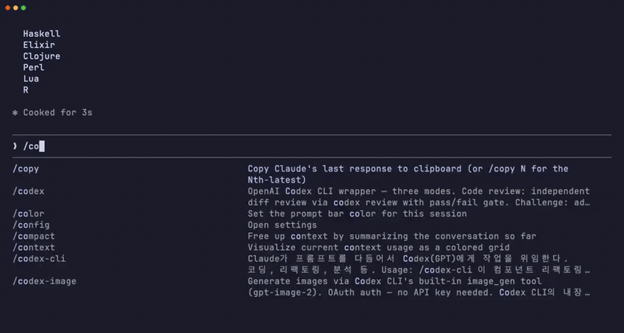

# codex-image

**Claude Code skill that generates images through Codex CLI by default, with an optional Atlas Cloud provider.**

**기본값은 Codex OAuth이며, 선택적으로 Atlas Cloud API를 사용할 수 있는 Claude Code 이미지 생성 스킬.**

[](LICENSE)
[](https://docs.anthropic.com/en/docs/claude-code)
[](https://platform.openai.com)

**Install in one line:**

```
/plugin marketplace add wjb127/claude-skills
/plugin install codex-image@wjb127-skills
```

Part of [**claude-skills**](https://github.com/wjb127/claude-skills) — 7 Claude Code skills built while shipping real client websites.



*One slash command, no API key. Real session — playback sped up.*


*Prompt: "A lone astronaut standing on the edge of a crater on Mars, looking at Earth rising on the horizon, cinematic composition"* · `1024x1536` · `high` quality

---

## Why codex-image? / 왜 codex-image인가?

Most image generation tools require you to manage API keys, install Python SDKs, or leave your editor. **codex-image** lets you generate production-quality images without leaving Claude Code — and without ever touching an API key.

대부분의 이미지 생성 도구는 API 키 관리, Python SDK 설치, 또는 에디터를 벗어나야 합니다. **codex-image**는 Claude Code를 떠나지 않고, API 키 없이 프로덕션 품질의 이미지를 생성합니다.

```
/codex-image cherry blossom hanok courtyard, golden afternoon light
```

That's it. One command. / 이게 끝입니다. 명령어 하나.

Need an API-based path instead? Atlas Cloud is opt-in and does not change the
default OAuth flow. It validates the selected model against the live catalog
and schema, shows the current price before submission, submits each requested
image once, and polls only the result endpoint with bounded backoff.

API 기반 경로가 필요하면 Atlas Cloud를 명시적으로 선택할 수 있습니다. 기본 OAuth
동작은 유지되며, 실행 전 실시간 모델/스키마와 가격을 확인합니다.

---

## Gallery / 갤러리

### Product Photography / 제품 사진


*Prompt: "Elegant minimalist product photography: a single white ceramic coffee cup on dark marble surface, steam rising softly, dramatic side lighting"* · `1024x1024` · `high` quality

### Fantasy World / 판타지 세계관


*Prompt: "An epic fantasy landscape: a massive floating castle in the sky connected by glowing golden chains to mountain peaks below, waterfalls cascading from the floating island, dragon silhouettes circling the towers, bioluminescent flora, magical aurora in the twilight sky"* · `1536x1024` · `high` quality

### Coastal City Night / 해안가 도시 야경


*Prompt: "A breathtaking coastal Mediterranean city at night, white-washed buildings cascading down hillside to a crescent harbor, thousands of warm golden lights reflecting on calm dark blue water, luxury yachts, crescent moon, long exposure photography style"* · `1536x1024` · `high` quality

### Concept Art / 컨셉 아트


*Prompt: "A lone astronaut standing on the edge of a crater on Mars, looking at Earth rising on the horizon, cinematic composition, volumetric dust particles"* · `1024x1536` · `high` quality

> All images above were generated using this skill with `codex exec` → built-in `image_gen` → `gpt-image-2`.
> No API key was used. OAuth authentication only.
>
> 위 이미지는 모두 이 스킬로 생성되었습니다. API 키 없이 OAuth 인증만 사용.

---

## The Key Insight / 핵심 발견

We tested every auth path so you don't have to:

우리가 모든 인증 경로를 테스트했습니다:

| Method | Works? | Notes |
|--------|--------|-------|
| `OPENAI_API_KEY` → REST API | Yes | Standard, but requires API key management |
| OAuth token → REST API directly | **No (401)** | OAuth tokens are session tokens, not API keys |
| OAuth token → `codex exec` → `image_gen` | **Yes** | This is what codex-image uses |

**Codex OAuth tokens are ChatGPT session tokens**, not `sk-*` format API keys. The OpenAI REST API rejects them with HTTP 401. But `codex exec` has an internal bridge that routes OAuth authentication to the image generation service.

**Codex OAuth 토큰은 ChatGPT 세션 토큰**이며 `sk-*` 형식의 API 키가 아닙니다. OpenAI REST API는 401로 거부합니다. 하지만 `codex exec`는 OAuth 인증을 이미지 생성 서비스로 라우팅하는 내부 브릿지를 가지고 있습니다.

```
codex login (one-time / 최초 1회)
  → OAuth token stored in ~/.codex/auth.json
    → codex exec reads token automatically
      → Built-in image_gen tool authenticates via OAuth
        → gpt-image-2 generates image
          → Image saved to your project
```

---

## Prerequisites / 사전 준비

| Requirement | Command | Note |
|-------------|---------|------|
| **Claude Code** | [Install guide](https://docs.anthropic.com/en/docs/claude-code) | The host environment / 호스트 환경 |
| **Codex CLI** | `npm install -g @openai/codex` | Default provider only / 기본 provider 전용 |
| **Codex Login** | `codex login` | Default provider only; one-time OAuth via ChatGPT |
| **Atlas Cloud (optional)** | `export ATLASCLOUD_API_KEY=...` | Only for `--provider atlas`; never stored by the skill |

```bash
# Verify everything is ready / 설치 확인
codex --version          # OpenAI Codex v0.1xx.x
codex login status       # "Logged in using ChatGPT"
```

---

## Installation / 설치

### Option A: Global skill (all projects) / 전역 스킬 (모든 프로젝트)

```bash
git clone https://github.com/wjb127/codex-image.git ~/.claude/skills/codex-image
```

### Option B: Project-local skill / 프로젝트 로컬 스킬

```bash
git clone https://github.com/wjb127/codex-image.git .claude/skills/codex-image
```

After installation, the `/codex-image` command is immediately available in Claude Code.

설치 후 Claude Code에서 `/codex-image` 명령어를 바로 사용할 수 있습니다.

---

## Usage / 사용법

### Basic / 기본

```bash
/codex-image a red apple on white background
```

### Optional Atlas Cloud provider / 선택적 Atlas Cloud provider

```bash
/codex-image --provider atlas --size 1024x1536 futuristic seoul skyline at sunset
```

The skill first performs a read-only plan and asks for confirmation after
showing the live model schema and price. No paid POST is sent before approval.

### With options / 옵션 포함

```bash
# Vertical portrait / 세로형
/codex-image --size 1024x1536 futuristic seoul skyline at sunset

# High quality to specific folder / 고품질로 특정 폴더에 저장
/codex-image --quality high --out ./public/images korean hanok with cherry blossoms

# Multiple variations / 여러 변형
/codex-image -n 3 logo variations for a tech startup

# Landscape / 가로형
/codex-image --size 1536x1024 aerial view of jeju island coastline
```

### Options / 옵션

| Flag | Values | Default | Description |
|------|--------|---------|-------------|
| `--provider` | `codex` · `atlas` | `codex` | Generation provider / 생성 provider |
| `--model` | live Atlas model ID | `openai/gpt-image-2/text-to-image` | Atlas only / Atlas 전용 |
| `--size` | `1024x1024` · `1024x1536` · `1536x1024` · `auto` | `1024x1024` | Image dimensions / 이미지 크기 |
| `--quality` | `low` · `medium` · `high` · `auto` | `auto` | Generation quality / 생성 품질 |
| `--out` | directory path | project root | Save location / 저장 위치 |
| `-n` | 1–10 | `1` | Number of images / 생성 장수 |

### Output / 결과

Images are saved with timestamped filenames to prevent overwrites:

이미지는 타임스탬프 파일명으로 저장되어 덮어쓰기를 방지합니다:

```
codex-image-20260423-143052.png        # single image
codex-image-20260423-143052-1.png      # multiple: first
codex-image-20260423-143052-2.png      # multiple: second
```

Generated images are displayed inline in Claude Code for immediate review.

생성된 이미지는 Claude Code에서 즉시 확인할 수 있도록 인라인으로 표시됩니다.

---

## How It Works / 동작 원리

```
┌─────────────────────────────────────────────────────────┐
│  Claude Code                                            │
│  ┌───────────────────────────────────────────────────┐  │
│  │  /codex-image "cherry blossom hanok"              │  │
│  │       │                                           │  │
│  │       ▼                                           │  │
│  │  Parse args (size, quality, out, n, prompt)       │  │
│  │       │                                           │  │
│  │       ▼                                           │  │
│  │  codex exec ─────────────────────┐                │  │
│  │       │                          │                │  │
│  └───────┼──────────────────────────┼────────────────┘  │
│          │                          │                    │
│          ▼                          ▼                    │
│  ┌──────────────┐   ┌─────────────────────────────┐    │
│  │  OAuth Auth   │   │  Built-in image_gen tool     │    │
│  │  (auto from   │──▶│  Model: gpt-image-2          │    │
│  │  ~/.codex/    │   │  ┌───────────────────────┐   │    │
│  │  auth.json)   │   │  │ ~/.codex/              │   │    │
│  └──────────────┘   │  │ generated_images/       │   │    │
│                      │  │ <session>/ig_*.png      │   │    │
│                      │  └───────────┬───────────┘   │    │
│                      └──────────────┼───────────────┘    │
│                                     │                    │
│                                     ▼                    │
│                          ┌──────────────────┐            │
│                          │  Copy to project  │            │
│                          │  root / --out dir │            │
│                          └──────────────────┘            │
└─────────────────────────────────────────────────────────┘
```

---

## Prompt Tips / 프롬프트 팁

Writing good prompts makes a huge difference. Here's what works:

좋은 프롬프트가 결과를 크게 바꿉니다. 효과적인 방법:

### Structure / 구조

```
Scene/backdrop → Subject → Details → Constraints
배경/장면 → 주체 → 디테일 → 제약조건
```

### Do's / 권장

- **Be specific about lighting**: "warm golden hour side light" > "good lighting"
- **Include camera language**: "shallow depth of field", "aerial view", "close-up macro"
- **Specify style**: "photorealistic", "oil painting style", "3D render", "concept art"
- **Add mood/atmosphere**: "serene", "dramatic", "moody", "vibrant"
- **Mention quality**: "8K detail", "high resolution", "ultra detailed"

### Don'ts / 금지

- Avoid vague prompts: "a nice picture" (too generic)
- Don't overload with contradicting styles
- Skip negative prompts (not supported in gpt-image-2)

### Example Prompts / 예시 프롬프트

| Category | Prompt |
|----------|--------|
| **Product** | `Elegant perfume bottle on reflective black surface, studio lighting, luxury brand catalog style` |
| **Landscape** | `Aerial drone shot of Jeju coastline, turquoise water meeting volcanic rock, golden hour` |
| **Food** | `Overhead flat-lay of Korean bibimbap in stone pot, steam rising, vibrant vegetables, dark wood table` |
| **Architecture** | `Modern minimalist house with floor-to-ceiling windows overlooking a misty mountain valley` |
| **Portrait** | `Professional headshot, soft natural window light, shallow depth of field, neutral background` |
| **UI/Mockup** | `iPhone 15 Pro mockup showing a fitness app dashboard, clean UI, dark mode, floating on gradient background` |

---

## Troubleshooting / 문제 해결

| Issue | Solution |
|-------|----------|
| `NOT_FOUND` | Install Codex: `npm install -g @openai/codex` |
| Auth expired | Re-login: `codex login` |
| Trust error | Skill uses `--skip-git-repo-check`. Or trust project: add to `~/.codex/config.toml` |
| Timeout (>2min) | Try `--quality low` for faster generation |
| 401 on REST API | Expected — OAuth tokens can't call REST API directly. `codex exec` handles this. |
| No `image_gen` tool | Update Codex: `npm update -g @openai/codex` |

---

## Cost / 비용

Image generation costs are charged to your OpenAI account (via ChatGPT Plus/Team/Enterprise).

이미지 생성 비용은 OpenAI 계정(ChatGPT Plus/Team/Enterprise)에 청구됩니다.

| Size | Quality | Approximate Cost |
|------|---------|-----------------|
| `1024x1024` | `low` | ~$0.02 |
| `1024x1024` | `high` | ~$0.04 |
| `1024x1536` | `high` | ~$0.06 |

Refer to [OpenAI pricing](https://openai.com/api/pricing/) for the default OAuth
path. The Atlas helper reads its current per-image price from the live model
catalog during the mandatory dry run; the README intentionally does not pin it.

---

## Security / 보안

- **Codex remains OAuth-only by default** — no API key is needed
- **Atlas is explicit opt-in** — `ATLASCLOUD_API_KEY` is read from the environment and never stored or logged
- **No telemetry** — no analytics, no error reporting, no tracking
- **Controlled outputs** — generated images are downloaded only to the selected project path; this text-to-image path does not upload local files
- **Provider isolation** — Codex credentials are never sent to Atlas, and Atlas credentials are never sent to OpenAI

기본 Codex 경로는 API 키가 필요 없습니다. Atlas 경로의 키는 인증 헤더로만 전송되며 저장되거나 로그에 기록되지 않습니다.

---

## Project Structure / 프로젝트 구조

```
codex-image/
├── SKILL.md          # Claude Code skill definition / 스킬 정의
├── scripts/
│   └── atlas_image.py # Optional Atlas catalog/schema/submit/poll helper
├── tests/
│   └── test_atlas_image.py
├── README.md         # Documentation / 문서
├── LICENSE           # MIT License
├── .gitignore
└── examples/         # Generated sample images / 생성 예시 이미지
    ├── product-coffee.png       (1024x1024, high)
    ├── fantasy-castle.png       (1536x1024, high)
    ├── coastal-night.png        (1536x1024, high)
    └── mars-poster.png          (1024x1536, high)
```

---

## Credits / 크레딧

- Inspired by [daedal](https://github.com/Hostingglobal-Tech/daedal) — Rust CLI for gpt-image-2 (API key auth)
- Built for [Claude Code](https://docs.anthropic.com/en/docs/claude-code) skill system
- Uses [OpenAI Codex CLI](https://github.com/openai/codex) for OAuth-authenticated image generation

## License / 라이선스

MIT — see [LICENSE](LICENSE)
